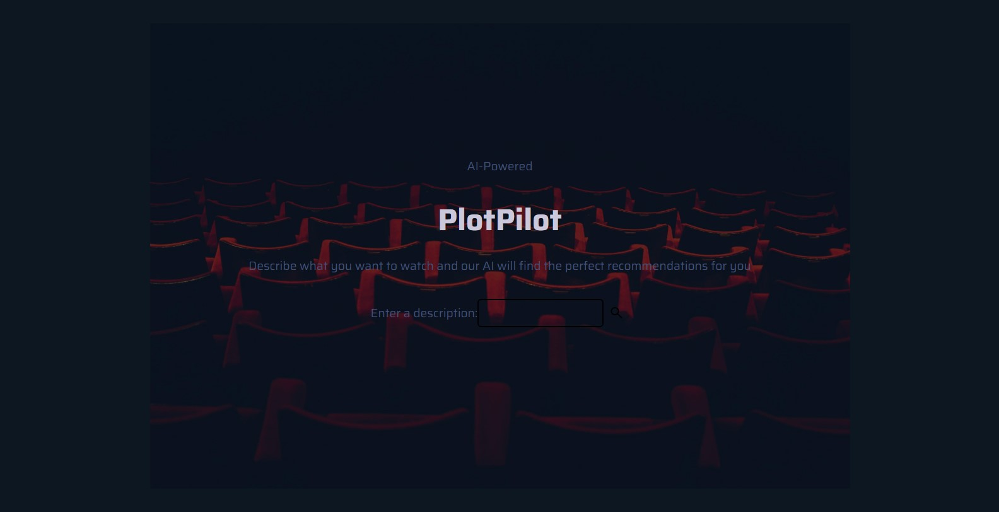
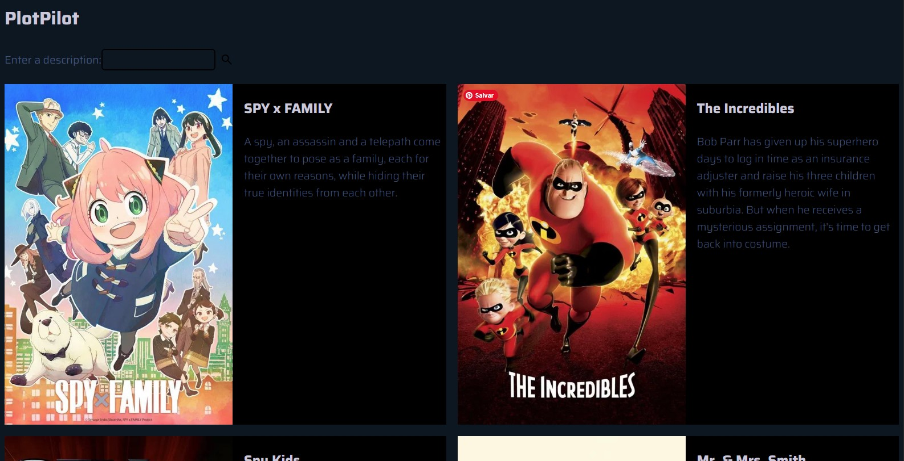
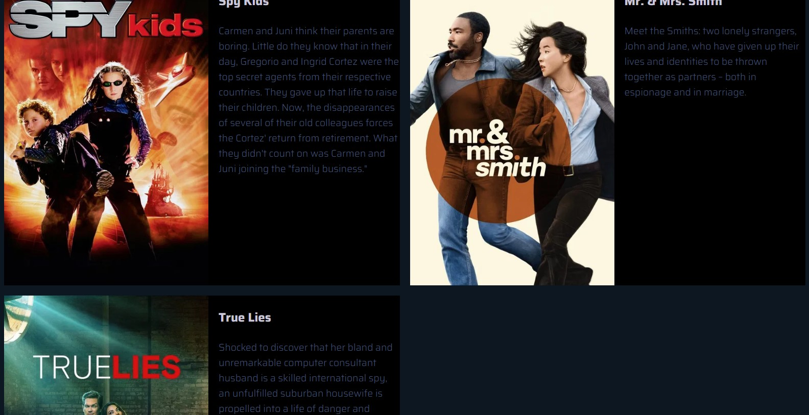
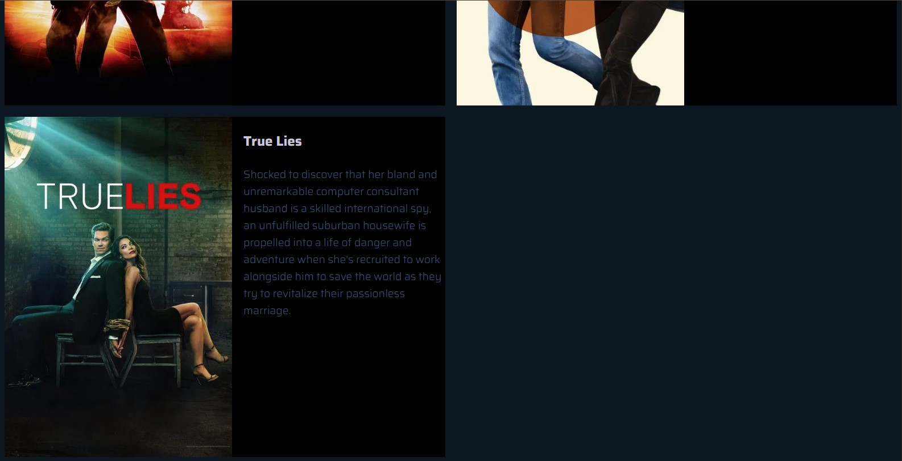

# 🚀 PlotPilot

> This WEB project uses AI to sugest 5 watchable contents, such as series, movies or animes, based on the user description of what he wants to watch.

[](https://opensource.org)

---

## 🎯 Live Demo & Links
* **Live Application:** [View Live Site](https://recomendador-de-filmes-series-animes-production.up.railway.app)

---

## 📸 Preview
<!-- Add an animated GIF or high-res screenshot showing your project in action -->
<p align="center">
  
  
  
  
</p>

---

## ✨ Features
* **Natural Language Search:** User describes what he wants to watch.
* **AI Recommendation:** Google Gemini AI suggests 5 titles based on the description.
* **Automatic details:** Automatically searches for the overview and poster from TMDB.
* **Dark Interface:** Dark mode design inspired by modern streaming platforms.

---

## 🛠️ Tech Stack & Architecture

### Language & Frameworks
* **Language:** Python
* **Framework:** FastAPI

### APIs
* **IA:** Gemini API
* **Data:** TMDB API

### Frontend
* **Styling:** HTML/CSS

---

## 🚀 Getting Started

Follow these steps to set up the project locally on your machine.

### Prerequisites
* Python
* Poetry

### 1. Clone the Repository
``` bash
git clone https://github.com
cd plotpilot
```

### 2. Install Dependencies
``` bash
poetry install
```

### 3. Environment Variables
Create a `.env` file in the root directory:
```bash
GEMINI_API_KEY = your_gemini_key
TMDB_API_KEY = your_tmdb_key
```

### 4. Run the Application
``` bash
poetry run task run
```

---

## 💡 Key Learnings & Engineering Challenges
* **Challenge Title:** The biggest challenge in this project was to integrate the files, make the communication between them work, I was having a lot of trouble with the idetification.
* **Resolution:** Reorganized the files and  changed the import way.
* **What I Learned:** What I learned from this expirience was to keep the files organized from the beginning.

---

## 📄 License
Distributed under the MIT License. See `LICENSE` for more information.

---

## ✉️ Contact
* **Antônio:** [LinkedIn](www.linkedin.com/in/antônio-garcia-98a112336)
* **Project Link:** [https://github.com](https://github.com/chocottony/Recomendador-de-filmes-series-animes)
* **Email:** kraftoiko@gmail.com
